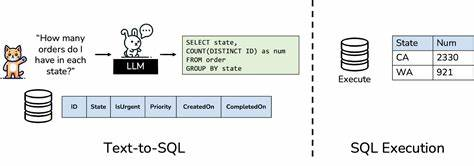

# Text-to-SQL: AI-Powered Natural Language to SQL Query Generator

## Overview
Text-to-SQL is a GenAI-based tool that translates natural language queries into SQL commands and retrieves data from an SQLite database. It uses Google's Generative AI (Gemini) to generate SQL queries dynamically, enabling seamless interaction with databases without requiring SQL expertise.



## Features
- **AI-Driven Query Generation**: Converts English queries into optimized SQL statements.
- **Database Connectivity**: Executes generated SQL queries on an SQLite database.
- **Predefined Prompt for SQL Translation**: Ensures structured and accurate SQL generation.
- **Streamlit UI**: Provides an interactive web interface for user queries.
- **Error Handling**: Validates and corrects query execution.

## Installation
### Prerequisites
- Python 3.8+
- pip package manager
- SQLite database driver

### Steps


## Usage
1. Run the Streamlit app:
   ```sh
   streamlit run sql.py
   ```
2. Enter a natural language query (e.g., "Show all students in Data Science class").
3. The system generates and executes the SQL query, displaying the results.

## Example


## Roadmap
- Enhance AI model fine-tuning for better SQL translation
- Expand support for other databases (MySQL, PostgreSQL)
- Implement user authentication for secure query execution


